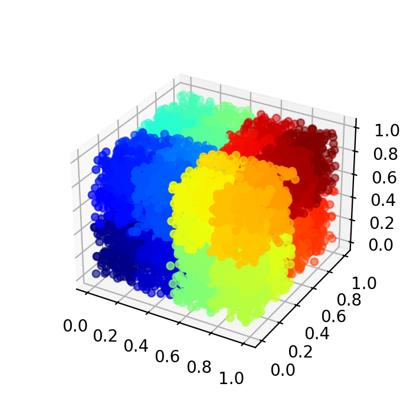

# Despace


<a href="https://colab.research.google.com/github/Ruibin-Liu/despace/blob/main/docs/source/notebooks/Examples.ipynb" target="_parent"></a>
[](https://badge.fury.io/py/despace)
[](https://doi.org/10.5281/zenodo.6369236)

## Introduction

Hierarchical spatial decomposition has been shown to be super useful in many geometric problems like geological analysis and N-body simulations. The general goal is to index multi-dimensional data points while keeping spatially proximal points as close as possible. Traditionally, `k-D` trees and space filling curves (Hilbert/Peano and Morton curves) are constructed to divide the `k` dimensional space first. For `k-D` trees, every data point will be assigned to the tree leaves and leaves close to each other in the tree structure are also spatially close to each other. For space filling curves, each data point in the space is assigned to the nearest space filling curve vertex. The whole data set can therefore be sorted along the space filling curve direction.

Constructing and traversing the `k-D` trees and `k`-dimensional space filling curves can be annoying in some certain cases. Here I am instead trying to use a simple sorting scheme to index or sort `k` dimensional data so that close data points are stored closely in the final data structure.

Note: 'dimension' here means physical dimensions like in 2D and 3D cartesian coordinates. It's different from the definition of 'dimension' in `numpy.ndarray` which refers to number of axes to describe the data layout. Mostly we can think of the 'dimension' in this repo as the number of columns in a 2d numpy array (matrix).

## Algorithm

1. Sort the entire data points in the first dimension.
2. Divide the data into two halves and sort each half in the second dimension.
3. For each sorted half data, divide it into two halves and sort it in the third dimension.
4. Continue the above procedure by circulating the dimension indices until dividing into single data points.
5. Reconstruct the whole data set with the above pseudo-sorted data

## Install

```
pip install despace
```

## Current status

For a 8X8 grid, we get a Morton curve if we init the `sort_type` as `Morton` (the default):


We get a Hilbert curve if we init the `sort_type` as `Hilbert`:


`k-D` cases are primarily done for the `Morton` type. Visualization for 2D and 3D cases is supported. Below shows plots of `N=10000` random points in a 2D square space and a 3D cube. The data points are blue-->red colored according to their indices from 0 to 9999.




For the `Hilbert` type, only 1D and 2D cases have been implemented.

## Try it out

1. You can play with the python script `generate_random.py` in the `examples` folder like changing the number of data points

```
python generate_random.py 50 2 # use 50 data points for 2D.
```

And we get a figure like below:


2. Use in your code

```python
from despace import SortND
import numpy as np

s = SortND()
s(np.random.rand(50, 2))
s.plot(show_plot=False)  # Set show_plot=True in jupyter-notebook
```

We shall get a similar figure as the above example.

3. Try in Google Colab

Click the button <a href="https://colab.research.google.com/github/Ruibin-Liu/despace/blob/main/docs/source/notebooks/Examples.ipynb" target="_parent"></a> and follow the examples in the Google Colab file.
